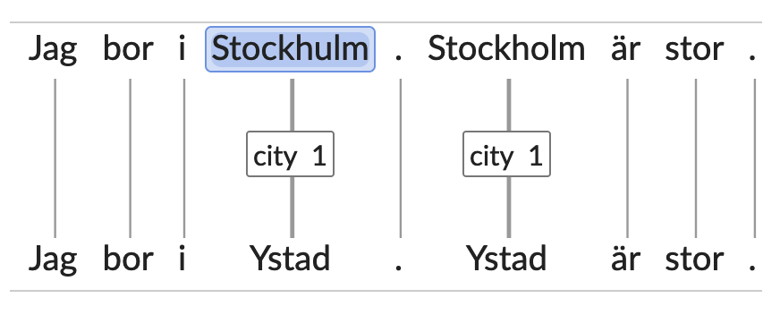
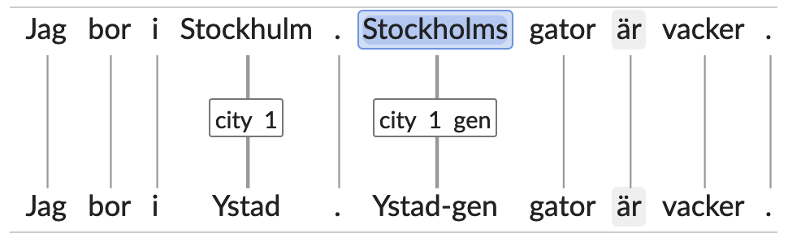
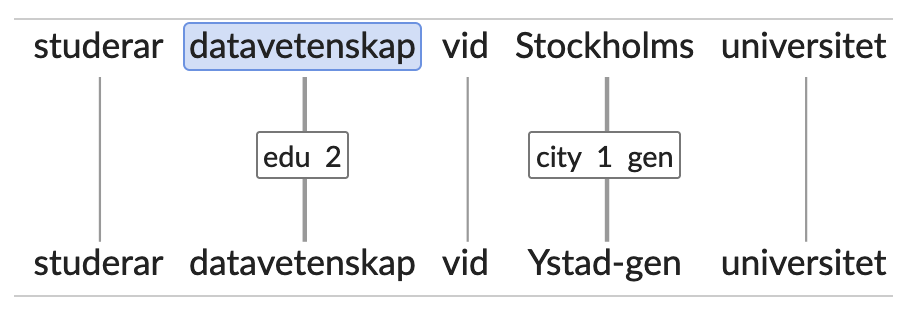
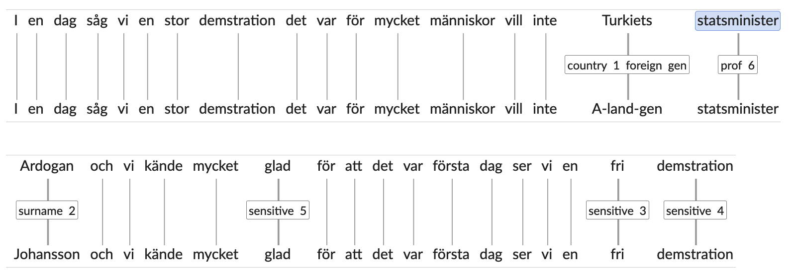
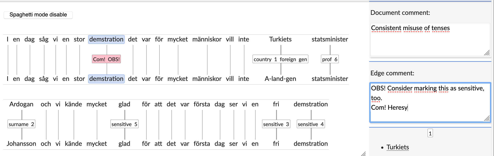
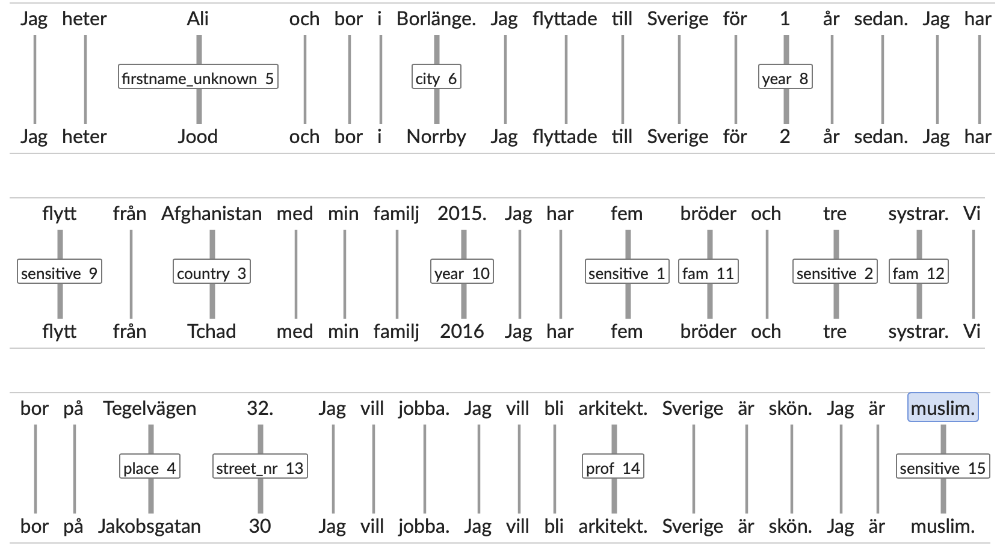

# Pseudonymization guidelines

_Beáta Megyesi, Lisa Rudebeck, Elena Volodina, June, 2018 -- May 2019_

---

The purpose of pseudonymization is to de-identify all information that can reveal the identity of the person who wrote the text. This information can include person names, age, addresses and phone numbers, city names and other geographical names, etc.

On top of this, some information is also marked as "potentially sensitive" during the pseudonymization process. This is information which does not in itself disclose the identity of the writer, but which would be particularly harming to reveal were the identity of the writer to be disclosed in spite of the de-identifying efforts. Sensitive information is for instance information on political or religious views of the writer. The information marked as potentially sensitive will be reviewed before publication of the corpus to evaluate whether it needs to be hidden or not.

Your task as an assistant is 1) to identify all information that can relate to the specific person who wrote the text, and categorize what type of information it is so that the person can be de-identified by changing/hiding the specific information, and 2) to mark potentially sensitive information related to the writer. The replacement of the personal information is performed automaticaly given the assigned label. 

This document contains instructions for how to proceed. 

---
## Basic principles
---

1. Remove/change the information that can reveal a person behind the essay(s), yet keep to the _minimal change_ rule. The data should be usable in research scenarios. 

2. Data on _deviations from standard Swedish will be lost_ for the pseudonymized strings (e.g. mis-spellings etc.). This also holds for text segments the form of which is dependent on the pseudonymized string (for instance prepositions preceeding pseudonymized city and country names, e.g. in Germany -> in Cuba).

3. Annotators have to make the _assessment of the risks and needs_ for pseudonymization (an element of subjectivity).

4. Tokens should not be pseudonymized solely on the basis of them belonging to a specific category listed among the pseudonymization categories, but on the basis of them _potentially revealing the identity of the writer_. For instance, not all country or city names are pseudonymized, but only those which, **together with the context**, 1) may be connected to the writer (e.g. because the city may be identified as the writer's home town), and 2) reveal information which is specific enough to be used to identify the writer. Accordingly, in a text where Istanbul is mentioned as a city where the writer has lived or as a city where a family member of the writer lives (etc.), _Istanbul_ should be pseudonymized. But not so in a text providing general information about Istanbul. And while the information that the writer stems from the Baltic countries may be reason to pseudonymize _Baltikum_ (as a region), the information that the writer stems from Europe does not necessitate pseudonymization, since Europe is such a large region which may be assumed to be the home region for a large number of potential writers.

5. Keep _track_ of whether the token is “original” or “masked”. (This is done automatically by the annotating tool.)

6. Categories that need to be _marked in the texts, but not necessarily replaced_. An assessment should be made later when enough statistics is collected over the learners behind the essays , as well as the assembled texts and metadata on each particular writer: 
  * country: the same pseudonymization tag, < country >, is used for: 
    - country of origin (_Jag kommer från Syrien_ versus _Jag kommer från Luxembourg_) - depending upon how many subjects in the database are from the named countries
    - country of “intermediate” residence (_Vi har stannat en månad i Turkiet_)
    - **Note:** Mentions of _Sweden_ as a country of origin or residence are not marked.
  * number of family members (_Jag har fem bröder och fyra systrar_ --> Eng. "I have five brothers and four sisters") - an estimation is necessary to see whether it is a normal pattern in many essays. If yes - no masking/suppression is necessary
  * professions (_Jag är webbutvikler_)
  * education

7. Categories that can be used for discrimination, such as political views, religious convictions or sexual orientation, should also be marked (with the tag < sensitive >) without being masked right away. A decision needs to be made later in the process, before publication. E.g. _I en dag såg vi en stor demstration det var för mycket människor vill inte Turkiets statsminister Ardogan och vi kände mycket glad för att det var första dag ser vi en fri demstration._

8. Although information about languages spoken by the writer may help identifying the writer, such information is not pseudonymized, since this information is nevertheless included in the metadata which will be available for the corpus users.

---
## Supra-categories 
---

May be applied on top of other categories, as (extra)linguistic information.

---
### Running numbers
---

Applies to all _personally identifiable information (PII)_ and their *@placeholders*. Each unique PII type (e.g.name) should get its own running number, starting with 1 in each individual essay. If the same PII is repeated in the text, the same running number is assigned to it. This is done automatically, but the automatically assigned running number may be changed manually. A manual change of the running number is necessary when the same PII (for instance the same city) is referred to by non-identical strings (for instance due to mis-spelling).

<!---->

---
### Morphology: 
---

 * Case: < gen > , e.g. Volvo**s**
 * Definiteness: < def > , e.g. Stadsbiliotek**et**s
 * Number: < pl > , e.g. Mölndalsb**or**
 * Only marked forms are tagged, i.e. genitive case is marked, whereas nominative case is not (by default everything is assumed to have nominative case).
 
 

<!---->

---
## Pseudonymize: 
---

### 1. Personal Names: 
---

  * Types: < firstname_male > , < firstname_female > , < firstname_unknown > , < initials > , < middlename > , < surname >  
  * < firstname > vs < surname > are sometimes difficult to distinguish between. In uncertain cases, follow the standard Swedish order: < firstname > < middlename > < surname >

  * Pseudonymization: (suggested source is from a national statistical agency: https://svn.spraakbanken.gu.se/sb-arkiv/lexikon/scb-namn) <!-- , see more information at the bottom of this document)-->
      - Provide a list with first names, male, female and gender neutral (incl. international). 
      - For surnames, gender-specific types, when unclear use gender-neutral names 
      - Provide a list with surnames (incl. international)
      - Middlenames: Replace with an initial “A”
      - Initial: Replace by “A”, keep delimiters

  * To consider: 
      - allow cross-reference/anaphora resolution, i.e. allow to keep track of the PIIs that the L2 learner refers to, e.g. if more than one unique name occurs in the text, each unique name shall be replaced by a unique pseudonym. This is handled automatically, through the procedure with running numbers (see above). 
      - random substitution for each unique name in the text given a list of names or
      - select a few names (while keeping the gender and cross-reference info) and use these names - throughout all texts

      

---
### 2. Geographic data (country, city, zip codes, area names, …)
---

  * Types: < foreign >, < area > , < city > , < geo > ,  < country > , < place > ,  < region > ,  < street_nr >, < zip_code > 
       - < foreign > : this tag is combined with the following tags when applied to places _outside of Sweden_: < region > , < city >, < place > , < geo >. For places in Sweden the same four tags are used _without_ the additional tag < foreign >.
       - < country > : except Sweden
       - < zip_code > : zip/area code
       - < region > : geographical/political unit larger than a city but not equivalent to a country. E.g. _Sörmland_, _Stockholms län_, _Region Blekinge_, _Svealand_, _Sydirak_, _Toscana_, _Baltikum_. Regions outside of Sweden are marked with the additional tag < foreign >.
       - < city > : the tag < city > is used for a large category of populated areas, including cities, urban districts both larger and smaller than cities, and villages. Cities outside Sweden are marked with the additional tag < foreign >.
       - < area > : part of a city, e.g. _Vesterbro_, _Greenwich village_. The tag < area > is only used for non-Swedish settings, and is always (reduntantly) combined with the tag < foreign >. (For Swedish settings the tag < city > is used also for city parts.)
       - < place > : specific place, street, square, bridge, name of a bus/tram/metro stop. Places outside Sweden are marked with the additional tag < foreign >.
       - < geo > : This tag is used for any additional type of geographic name not among the other categories, for instance forests, lakes, mountains, etc. Geographical names referring to entities outside Sweden are marked with the additional tag < foreign >.
       - < street_nr > : street or place number
  * Uncertain categorization:
       - In some cases local knowledge or extensive research is needed in order to determine the most suitable category for a geographic name: It may be hard to figure out whether a name rather refers to a region or to a city, to a city or to an area, etc. Such extensive research is not motivated by the objective of the pseudonymization; what's important is that information potentially revealing the identity of the writer is pseudonymized, and that the categorization (and subsequent replacement) of the pseudonymized entities in the text are consistent with the rest of the information given in the text.
            
  
 
 <!---->
      

<!-- c **_WHAT DO WE MEAN BY REGION? Should person's place of living, like "Baltorp" in Mölndal or "Sköndal" in Stockholm be marked as "region"? Or "area" ? (Elena, A10AT1) In the case of "jag bor in irak maysan soudirak" how to mark "maysan" versus "soudirak" (Elena, A11AT1)) ???_** -->
  <!-- * Descriptor: 
     - Running number: < 1, 2… > [enumerate each unique name type entity with a number starting with 1] -->
 
  * Pseudonymization: (suggested source:  http://www.geonames.org <!--, see more information at the bottom of this document)-->
      - Random substitution given a list of named entities of various attributes for each attribute, except for Sweden 
      - < zip_code >: ABCDEF alt Replace letters with ABC and each number with 0 (ABC 0000), keep the delimiter

---
### 3. Institution: < school > , < work > , < other_institution >
---

  * The institution tags are used to pseudonymize institutions mentioned in the texts which may be used to identify the writer, such as the school, work or sport's team of the writer (or a person related to the writer).
    - < school > is used for all education-providing institutions (primary school, secondary school, university, etc.)
    - < work > is used for an institution which is revealed as the writer's working place (or the working place of a person related to the writer). When an institution is identified as a working place, the tag < work > is applied instead of other tags which may otherwise be applied. For instance: If a text reveals that the writer works in a named school, the tag < work >, rather than the tag < school >, is used to pseudonymize the name of the school.
    - < other_institution > is used for all other institutions in need for pseudonymization, such as a sport's team or an NGO
  * Pseudonymization: 
      - Replace from a list of school names and companies (e.g. from Yellow pages) alternatively use _A-school, B-workplace, C-institution_
   
---
### 4. Transportation: < transport_name >, < transport_nr >
---

  * < transport_name >: used for transport lines or transport systems with specific names, e.g. *gröna linjen, Lidingöbanan, Pågatågen*
    - *Tvärbanan*, and similar words which may be interpreted both as type nouns and as names for specific lines, are pseudonymized with this tag.
    - Words which clearly refer to transportation types rather than to specific lines, such as *tunnelbana, buss, pendeltåg* etc. should not be pseudonymized, although some of them reveal a city or limit the number of possible cities.
  * < transport_nr > : used for the number of a specific line, e.g. "buss *528*", "linje *3*". The tag should be placed only on the *number*.
  * Pseudonymization: 
    - < transport_name > : Replace with *A-linjen, B-linjen* etc. to avoid adding inconcistensies into the text
    - < transport_nr > : Replace actual number with 1, in case of several numbers in the same text, enumerate (1, 2, 3…)
  * **Note**: Names of stations and stops, such as *Mariatorget, Centralen*, are pseudonymized with the tag < place > in the *geographic data* group.

---
### 5. Age: < age_digits >, < age_string >
---

  * Person’s age (e.g. 18 years old)
  * Pseudonymization: 
      - Change the year within the range of numbers in 5-year interval. If an author writes 18 y.o., provide a number from a range of numbers < age > (+ - 2) - > e.g. 16-20. (This is done automatically by the annotation tool.)
      - The same as above applies to < age_string > , rendered in strings. <!--**The actual implementation of this pseudonymization category remains to be figured out.**--> 
      - ( There is a complication, though: if for example age is written in letters (and also misspelled, like "niotton" or "sIxtton"), then automatic replacement becomes nontrivial. There is a need of an option to add "pseudonimyzation" manually directly in the tool by rewriting the target token. At the moment this is not possible.  Another issue with this is that misspelling can be pretty bad and there is a need for "interpretation" by an assistant, e.g. "åttonde" år (elder sister) versus "tionde" år (little sister). Issues of this kind are handled individually on a case-to-case basis. <!--Added as an issue for anonymization tool. (Elena, A10AT1) )-->
         
---
### 6. Dates (all elements directly related to an individual, day, month, year) 
---

  * Types: < date_digits > , < day > , < month_digit >, < month_word >, < year > . 
 <!-- * Descriptor: --> 
 
  * Pseudonymization: Ideally - keep the delimiters as in the original (, . - /)
      - < day > - > random number between 1-28
      - < month_digit > - > random replace 1-12
      - < month_word > - > random replace: januari, februari, ...
      - < year > - > 5-year interval: e.g. 2013 is replaced by a random number from a range of numbers (+ - 2), i.e. 2011-2015
      - < date_digits > - used for all dates that are written as a sequence of numbers with delimiters. Replace all numbers with "1" to a standard from 11-11-1111, (keeping delimiters not implemented) e.g.   
         * 2018-12-01 --> @date_digits --> 1111-11-11
         * 18/01/12 -->  @date_digits --> 11-11-1111 
         * 180112 --> @date_digits --> 11-11-1111
         * 18.01.12 --> @date_digits --> 11-11-1111
         * 01/12 --> @date_digits --> 11-11-1111

---
### 7. Phone numbers < phone_nr >
---

  * Pseudonymization: 
      - Replace each number with a “0” in the sequence (e.g. 0000-000000) (and keep the delimiter)

---
### 8. Email addresses < email >
---

  * Pseudonymization: 
      - One single for all: email@dot.com

---
### 9. [personal] web pages (URL) < url >
---

  * Pseudonymization: 
      - Replace all with: url.com 

---
### 10. Social security numbers < personid_nr  >
---

  * Pseudonymization:  
      - Replace each number with: 123456-0000 (and keep the delimiter (-) )

---
### 11. Account numbers < account_nr >
---

  * Pseudonymization: 
      - Replace each number with 0 (and keep the delimiter(s))

---
### 12. Certificate/licence numbers (e.g. vehicle) < license_nr >
---

  * Pseudonymization: 
      - Replace letters with ABC and each number with 0 (ABC 0000)

---
### 13. Other sequence of numbers < other_nr_seq >
---

  * Pseudonymization: 
      - Replace each number with 0 (and keep delimiters)
      
---
### 14. Extra (something else, not covered in the previous categories)
---

  * When the pseudonymizer comes across some kind of information in a text which may potentially be used to identify the writer, but which is not covered by any of the other pseudonymization categories, the tag < extra > is used.
  * The < extra > tag may for instance be used to mark information about very specific events in the writer's life.
  * By default we consider all "Extra" tags as obligatory to pseudonymize. However, there is a need to re-evaluate the category after the initial pseudonymization and see whether there is a need to separate between obligatory and non-obligatory pseudonymization of "extras". 
  
  <!--[//]: # (In that case, the following could apply:)
  
  [//]: # (Description: < oblig >, < nonoblig >)
  [//]: #  (- < oblig > need to be replaced because of sensitivity)
  [//]: #  (- < nonoblig > might be sensitive and replaced later)-->

---
### 15. Mark up but do not pseudonymize: 
---

  * < prof >, professions, e.g. *webbutvecklare*
  * < edu >, education: Use for degrees etc., e.g. *datavetare*, "jag har en examen i *kemi*"
  * < fam>, family members: Use for words for family members, friends, etc., e.g. *mamma, farfar, son, kusin, kompis, vän*.

 

<!---->
 
  * < sensitive >, sensitive information:
      - Markup: assign a "sensitive" @placeholder to at least one token per sentence. When deciding which and how many tokens to mark with the < sensitive > label, a guiding principle is that pseudomization of the marked tokens could potentially suffice. However, the whole sentence needs to be reviewed later on before final decisions about these pseudonymizations are made, and fewer rather than more tokens should be marked. A possible solution for the example below is to mark the tokens “glad”, “fri” and “demstration”.
      - **Note**: Sensitive information which could be covered by other pseudonymization categories should be assigned these other labels, e.g. “Turkiet” and “Ardogan” in the example below.
      - **Consider in the future**: for < sensitive > we need to evaluate if subgroups are needed: e.g. religion, ethnicity, sexual orientation, political views, physical and mental disabilities

      Example: 
      
*I en dag såg vi en stor demstration det var för mycket människor vill inte Turkiets statsminister Ardogan och vi kände mycket **glad** för att det var första dag ser vi en **fri** **demstration***. 

-->

*I en dag såg vi en stor demstration det var för mycket människor vill inte **Turkiets < country, genitive >** statsminister **Ardogan < surname >** och vi kände mycket **glad < sensitive >** för att det var första dag ser vi en **fri < sensitive >** **demstration < sensitive >***. 

---
### 16. Comments < OBS! >, < Com! >, document comments
---

   * The < OBS! > tag is used for marking a place to return to or for making comments which may be useful for later stages in the work with making the text ready for the corpus release (i.e. normalization and correction annotation).
   * The < Com! > tag is used for marking specific text sequences in need of comments which are judged to be useful for the future users of the corpus and which are thus intended to be kept in the published corpus.
   * Both the < OBS! > tag and the < Com! > tag are connected to an "edge comment" field where notes may be made. The label(s) get red-pink background for easier identification when there is a need to return to it/them.
   * There is also a *document comment* field in which notes about the text as a whole may be made. These notes may provide essential information for later stages (normalization, correction annotation), or in some cases information which is meant for the corpus user and which is thus meant to be kept in the published corpus.
   

---
## Text example
---

---
## Resources (lists) for pseudonyms and automatic pseudonymization scripts
---

Resources and lists are collected in a private repository here:
https://github.com/SamirYousuf/LR_project 

---
## SweLL annotation tool
---

SVALA is used for both manual annotation and for supportive automatic pseudonymization. A demo-version of the tool can be found here: https://spraakbanken.gu.se/swell/dev/# 

<!--Manual for SVALA: coming-->

---
## SweLL publications on the topic
---

* Beáta Megyesi, Sofia Johansson, Dan Rosén, Carl-Johan Schenström, Gunlög Sundberg, Mats Wirén & Elena Volodina. (2018). Learner Corpus Anonymization in the Age of GDPR: Insights from the Creation of a Learner Corpus of Swedish. Proceedings of the 7th NLP4CALL workshop. (https://ep.liu.se/ecp/152/006/ecp18152006.pdf)[https://ep.liu.se/ecp/152/006/ecp18152006.pdf]

* Elena Volodina, Yousuf Ali Mohammed, Arild Matsson, Sandra Derbring, Beatá Megyesi. (2020). Towards Privacy by Design in Learner Corpora Research: A Case of On-the-fly Pseudonymization of Swedish Learner Essays. COLING-2020. (https://aclanthology.org/2020.coling-main.32.pdf)[https://aclanthology.org/2020.coling-main.32.pdf]

* Wirén Mats, Arild Matsson, Dan Rosén, Elena Volodina. 2019. SVALA: Annotation of Second-Language Learner Text Based on Mostly Automatic Alignment of Parallel Corpora. CLARIN-2018 post-conference volume. LiUP Press. (https://ep.liu.se/ecp/159/023/ecp18159023.pdf)[https://ep.liu.se/ecp/159/023/ecp18159023.pdf]

<!--[//]: # Details about geonames: 

[//]: # För att pseudonymisera ”platserna”, kan man använda  http://www.geonames.org 

[//]: # Det finns en hel del info och zip-filer där, så klicka på ”info”-länken (eller använd länken nedan) för att läsa förklaringar
http://download.geonames.org/export/dump/readme.txt

[//]: # För att ladda hem filerna, klicka på Free Gazetteer Data (eller använd länken nedan)
http://download.geonames.org/export/dump/readme.txt

[//]: # Det verkar att de mest användbara listorna (för oss) är:

[//]: # * se.zip (svenska geografiska namn, dock inkluderar de inte bara städer/byar, utan också berg osv)
[//]: # * alternateNamesV2.zip (innehåller städer över hela världen. Om man filtrerar på koden ”se” (eller ”sv”?) så får man städer med svensk ortografi
[//]: # * cities1000.zip (här listas alla städer med invånare över 1000, samt också vilket land de tillhör/country codes, men de listas med alla möjliga skrift, så vi behöver använda denna fil ihop med alternateNamesV2.zip och matcha på geonameid)

[//]: # Vi behöver leka lite med dessa filer. Enligt info-länken, så finns det även koder för kontinenter, till exempel. Filerna är superstora, så dator kan lätt hänga sig om man försöker öppna filerna…

[//]: # ## Details about personal names: 

[//]: # Vi har datan från SCB med för- och efternamn här:
[//]: # https://svn.spraakbanken.gu.se/sb-arkiv/lexikon/scb-namn

[//]: # (litet skräpig data; vi påbörjade arbetet med att skapa en namn-saldo, men det stannade av. saldo-namn.xml innehåller senaste versionen av namn-morfologin)

[//]: # ## About workplaces (category 3) and professtions (15):
[//]: # (3.)
[//]: # Companies ( < work > ):
[//]: # https://sv.wikipedia.org/wiki/Lista_över_företag_på_Stockholmsbörsen_–_medelstora_företag
[//]: # http://www.largestcompanies.se/topplistor/sverige/de-storsta-foretagen-efter-omsattning

[//]: # Universities and schools ( < institution > , < school > ):
[//]: # https://sv.wikipedia.org/wiki/Lista_över_universitet_och_högskolor_i_Sverige

[//]: # < Other_institutions > ?

[//]: # (15.)
[//]: # < profession > : t.ex.
[//]: # https://www.gymnasium.se/yrkesguiden/alla-yrken-10957 
[//]: # https://www.saco.se/studieval/yrken-a-o/ 

[//]: # < education > ? 

[//]: # ## More notes:

[//]: # * See pages 4-5, notes from SweLL meeting, August 2018:-->
<!--[//]: # https://spraakbanken.gu.se/sites/spraakbanken.gu.se/files/Minnesanteckningar_SweLL_Projektmote_20180830-31.pdf-->

